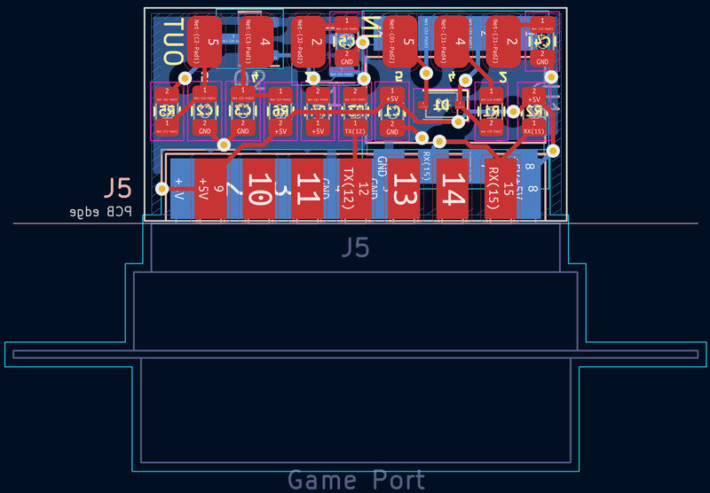
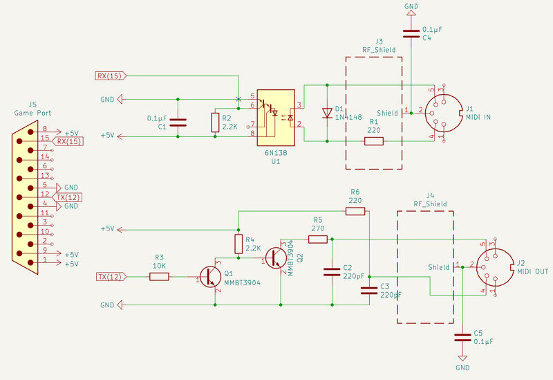
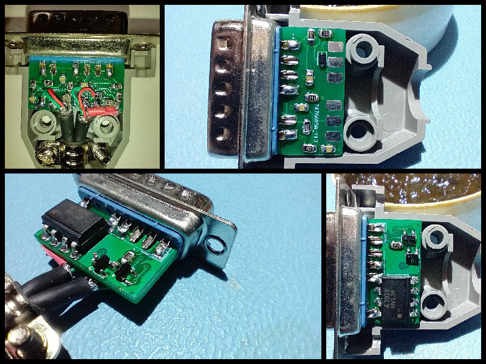
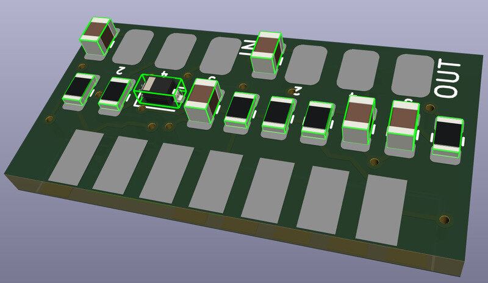
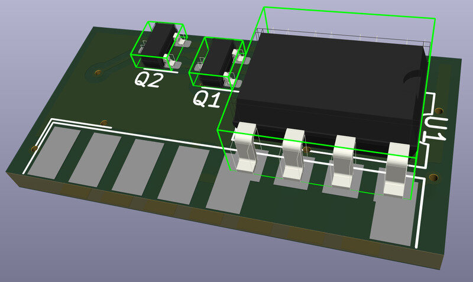

# Game Midi Breakout

This is my compact hobbyist design for converting game port (DB-15) to MIDI ports. It's made in Kicad. The PCB fits inside a [GOLD-TEK/GTK DH151 connector housing](https://www.taydaelectronics.com/connectors-sockets/d-sub-connectors/d-sub-cover-15-pins-with-short-screw.html).

** Note: This revision is untested. **

The previous revision had incorrect transistor pinouts, but I was able to verify its functionality with a bodge (upside-down transistors). This rev has had minor mods to schematic, and a near-complete re-layout. You're taking a chance I messed something up if you build it without verifying.

Here's what I changed: 

- Schematic
    + Swapped 2N3904 for the correct MMBT3904 transistor (corrects pinout)
    + added capacitors to ground the MIDI cable shield

- PCB layout
    + Caps/Resistors lined up, real nice
    + Silkscreen labels for component references
    + Everything but the OptoIsolator moved around and rerouted

## Pictures

### What you get 

### My first attempt with all it's warts

### 3D renders with most of the components

## BOM

| Quantity | Ref(s) | Value | Mfg Part No. | Description |
|----------|--------|-------|--------------|-------------|
| 1 | J5 | - | DA15PT | GTK 15-pin male D-Sub connector |
| 1 | -  | - | DH151PS/RH | GTK 15-pin D-sub cover |
| 1 | U1 | - | 6N138S | Opto-Isolator 5KV Darl w/Base 8SMD |
| 2 | Q1, Q2 | - | MMBT3904 | NPN Transistor 40V 0.2A SOT23-3 | 
| 1 | D1 | - | 1N4148WSTR | Diode 75V 300MA SOD323 | 
| 3 | C1,C4,C5 | 0.1 µF | CL21F104ZBCNNNC | Ceramic Capacitor 50V 0805 |
| 2 | C2,C3 | 220 pF | CL21B221KBANNNC | Ceramic Capacitor 50V 0805 | 
| 2 | R1, R6 | 220 Ω | CR0805-JW-221ELF | SMD Resistor 5% 1/8W 0805 | 
| 1 | R5 | 270 Ω | CR0805-JW-271ELF | SMD Resistor 5% 1/8W 0805 | 
| 2 | R2, R4 | 2.2 KΩ | CR0805-FX-2201ELF | SMD Resistor 1% 1/8W 0805 | 
| 2 | R3 | 10 KΩ | CR0805-JW-103ELF | SMD Resistor 5% 1/8W 0805 | 

Not included are any cables or MIDI connectors. Be creative. You can connect a pair of cables straight to male or female connectors, or run a single cable to a breakout box with a pair of connectors. Just connect IN or OUT if you like, etc.

## Making it

The D-Sub connector has to be modified before soldering. 

- Remove pins 6 and 7. Small pliers work well, wiggle and pull from the back.
- Pins 5 and 8 need to be cut short to make room for the opto-isolator, but you might wait until after U1 is soldered to check the sizing.

Assembly order:
- D1, Q1, Q2
- C1-C3, R1-R6
- C4, C5
- U1
- Remove and cut pins on J5 (15-pin connector) as described above
- J5
- Attach whatever MIDI cable/sockets you prefer

## The Design

The Output circuit comes from [ESS ES1869 Data Sheet, Page 24](https://www.philscomputerlab.com/uploads/3/7/2/3/37231621/es1869techmanual.pdf#page=24).

The Input circuit is similar, but I found the reference at [Teragon Audio](http://midi.teragonaudio.com/hardware/pc_intfc.htm) to be useful, and I took values and components from there.

The PCB is designed to be a close fit inside the connector housing. Rev 1.0 versions I produced at JLCPCB fit well in my initial build.

## Testing

I tested the adapter with a BTC 1853 Card (ES1868F chipset). I was able to transmit and recieve with a MidiMan MidiSport 1x1 USB adaptor. I also transmitted to a Roland MT-90s.
